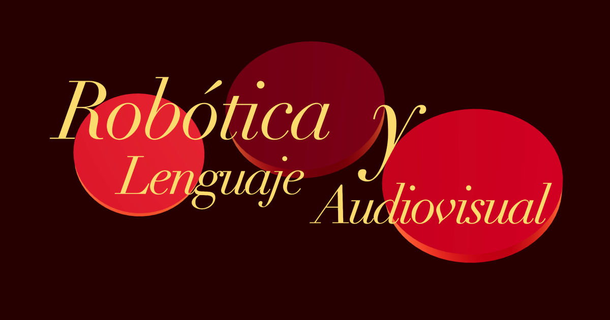

# Bitácora · Robótica y lenguaje audiovisual



Registro del curso **Robótica y lenguaje audiovisual** en [CENTRO](https://centro.edu.mx/), tercer semestre. No es un recetario cerrado ni un sitio institucional: es una bitácora personal que documenta lo que se ve en clase, el proceso de los proyectos terminales y las reflexiones que van quedando entre una sesión y la siguiente.

## Propósito

Cada entrada corresponde a una sesión. Ahí conviven teoría, referencias, ejercicios y notas propias. La redacción no siempre es lineal a propósito: importa más dejar constancia del pensamiento en el momento que forzar un ensayo pulido.

El archivo se actualiza de manera recurrente a lo largo del semestre. Irán apareciendo sesiones nuevas, correcciones y capas sobre lo ya publicado. Si encuentras un error de narración o de fuente, puedes abrir un pull request en este repositorio.

Nestor Rios Garcia ([@nestorrig](https://github.com/nestorrig))

## Cómo está hecha

Sitio web con una escena 3D de fondo y las entradas escritas en Markdown. El contenido vive aparte de la interfaz, para poder sumar o editar sesiones sin reconstruir el resto.

```bash
npm install
npm run dev
```

Abre [http://localhost:3000](http://localhost:3000).
